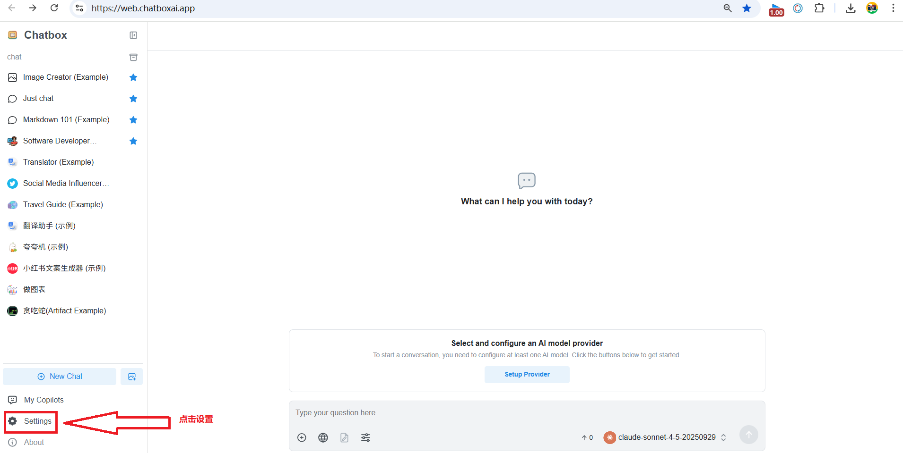
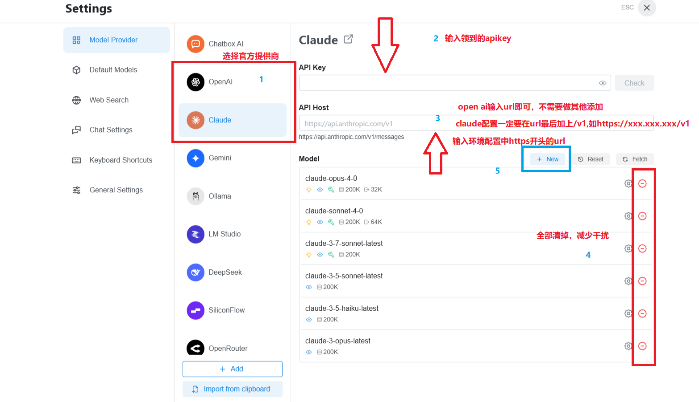
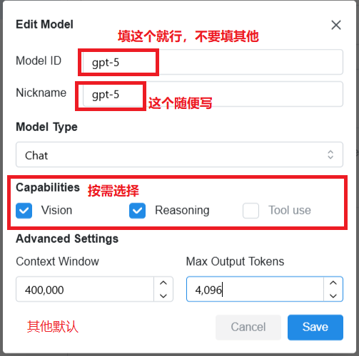
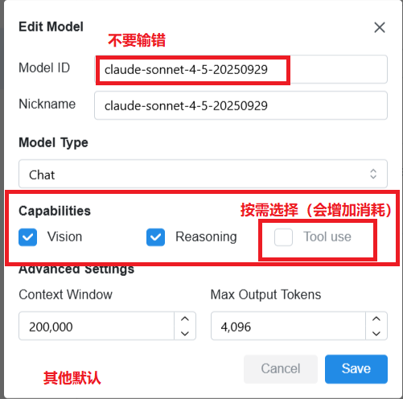
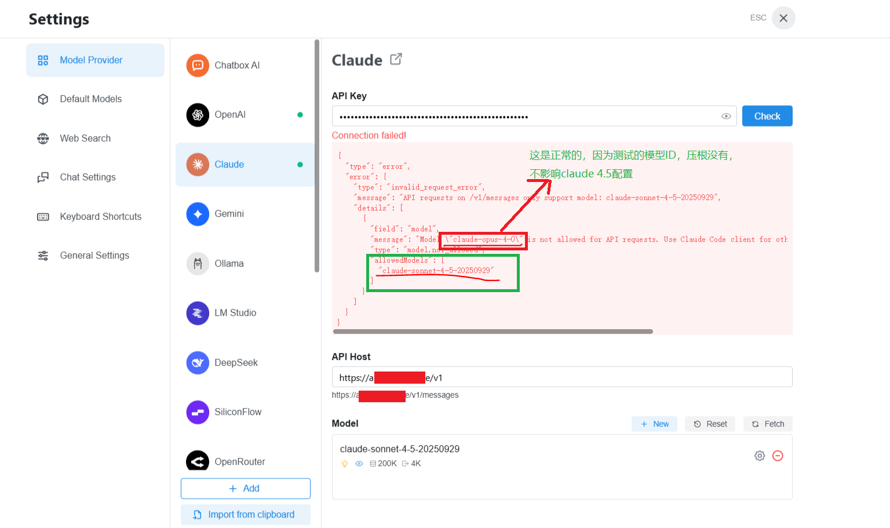
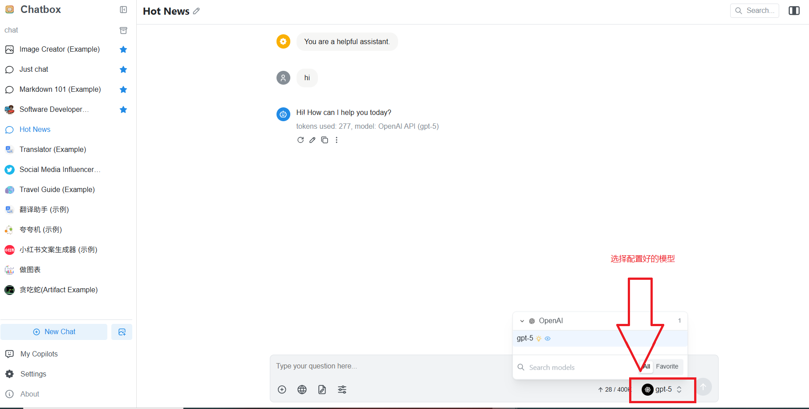

> ChatBox 是一款优秀的跨平台 AI 对话客户端，支持 Web、桌面端和移动端。本教程将指导你如何配置中转 API 来使用 Claude 和 OpenAI 模型。

## 第一步：打开设置界面

无论你使用的是 **Web 版**还是**移动端 App**，配置步骤基本一致。

首先，打开 ChatBox 并找到**设置**入口：

*如图所示，点击左侧菜单栏的设置图标（齿轮图标）进入设置页面。*

---

## 第二步：配置官方模型提供商

在设置界面中，找到**「AI 模型提供商」**或**「Model Provider」**选项。

ChatBox 支持配置多种模型提供商，包括：
- **OpenAI**（GPT 系列）
- **Claude**（Anthropic）
- **自定义中转 API**

*在这里你可以看到官方模型提供商的配置选项。*

---

## 第三步：新建自定义模型配置

### 配置 OpenAI GPT-5

点击**「添加自定义模型」**或类似按钮，按照以下步骤配置：

**配置参数说明：**

| 参数 | 填写内容 |
|------|---------|
| **模型名称** | `gpt-5`（或你想要的名称） |
| **API 地址（HOST）** | `https://你的中转API地址` |
| **API Key** | `sk-xxxxxxx`（你的中转 API 密钥） |
| **模型ID** | `gpt-5` |

配置完成后点击**「保存」**。

---

### 配置 Claude 4.5

同样的方式，添加一个新的自定义模型配置：

**配置参数说明：**

| 参数 | 填写内容 |
|------|---------|
| **模型名称** | `Claude 4.5` |
| **API 地址（HOST）** | `https://你的中转API地址/v1` |
| **API Key** | `sk-xxxxxxx`（你的中转 API 密钥） |
| **模型ID** | `claude-sonnet-4-5-20250929 |

配置完成后点击**「保存」**。

---

## 第四步：测试配置（重要说明）

### Claude 4.5 测试错误是正常现象

配置 Claude 4.5 后，点击**「测试」**按钮可能会返回错误提示，**这是正常现象**！

**原因：**
- chatbox测试发送的模型id不存在（chatbox内置）
- 测试失败不代表实际使用会出问题
- **建议：直接跳过测试，回到聊天界面实际使用**

---

## 第五步：开始使用

配置完成后，回到**聊天界面**，在模型选择器中选择你刚才配置的模型即可开始对话。

*在对话框顶部选择你配置的 GPT-5 或 Claude 4.5 模型，然后开始提问。*

---

## 常见问题

### 1. 配置后无法连接怎么办？

- 检查 API 地址是否正确（注意 `/v1` 后缀）
- 确认 API Key 是否有效
- 检查中转 API 服务是否正常运行

### 2. 对话时提示余额不足？

- 检查你的中转 API 账户余额
- 确认 API Key 是否有足够配额

### 3. 移动端和 Web 版配置有区别吗？

- 配置步骤完全一致
- 移动端界面可能稍有不同，但配置项相同

### 4. 可以同时配置多个模型吗？

- 可以！ChatBox 支持添加多个自定义模型
- 你可以在对话时随时切换不同模型

---

## 总结

通过以上步骤，你已经成功在 ChatBox 中配置了中转 API：

1. ✅ 打开设置界面
2. ✅ 找到模型提供商配置
3. ✅ 添加自定义 OpenAI 和 Claude 模型
4. ✅ 保存配置（测试错误可忽略）
5. ✅ 回到聊天界面选择模型使用

现在你可以愉快地使用 ChatBox 与 AI 对话了！

---

## 相关资源

- [ChatBox 官方网站](https://chatboxai.app/)
- [获取中转 API 服务](#)
