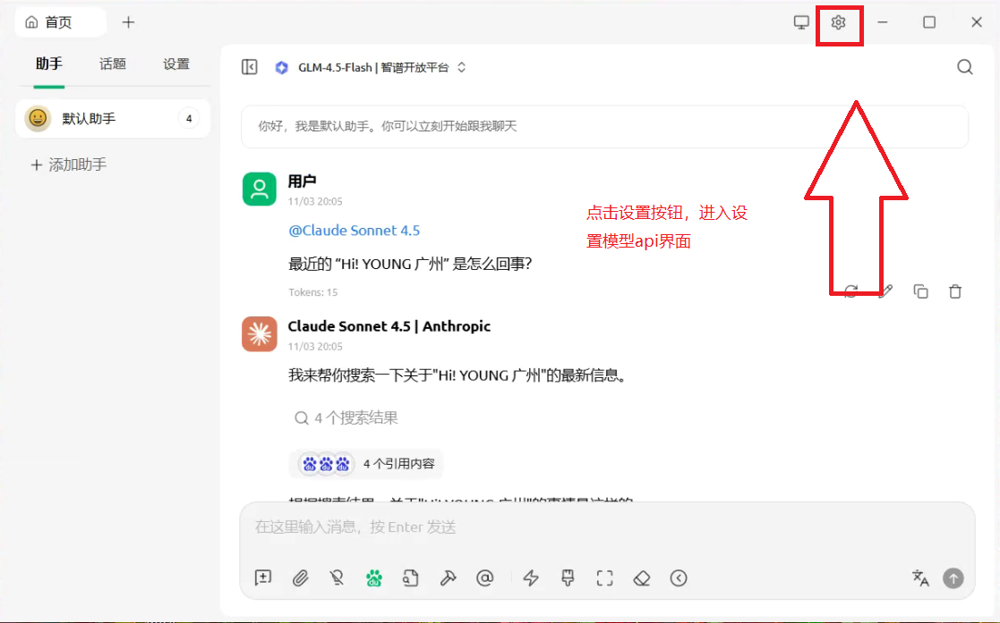
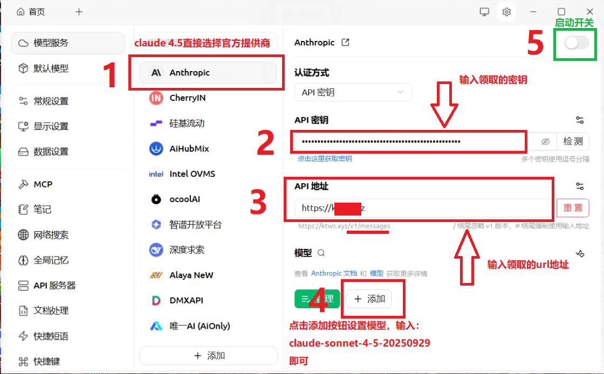
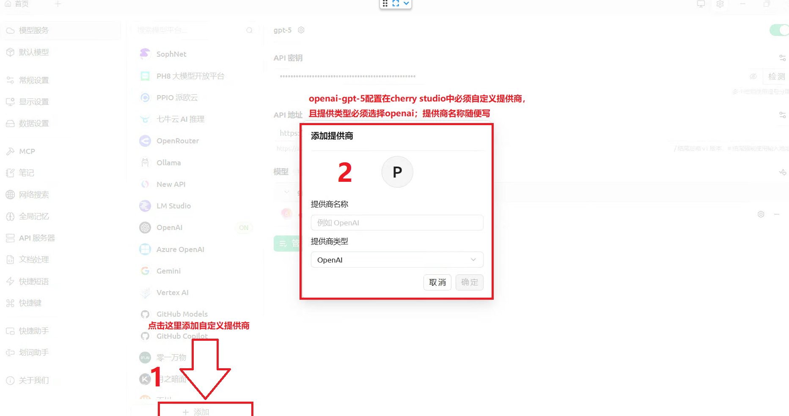
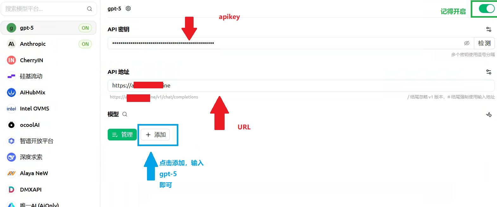
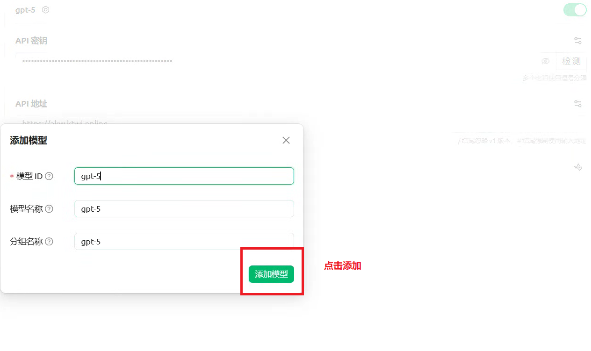
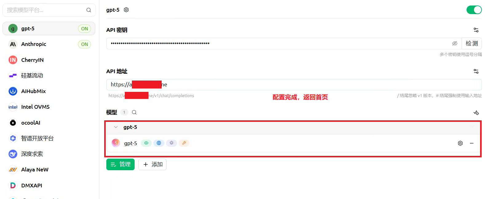

> Cherry Studio 是一款功能强大的 AI 对话客户端，支持通过自定义 API 接入多种大语言模型。本教程将详细指导你如何配置 API 中转服务，实现 Claude 4.5 和 GPT-5 模型的调用。

## 准备工作

在开始配置之前，请确保你已经准备好以下信息：

- **API 密钥（API Key）**：由 API 中转服务商提供的身份验证密钥
- **API 地址（URL）**：API 服务的接入地址

> 💡 提示：这些信息通常可以在你的 API 服务商控制台中获取。

---

## 配置 Claude 4.5 模型

### 第一步：进入设置界面

点击 Cherry Studio 界面右上角的**齿轮图标**，进入设置页面。

### 第二步：配置 Anthropic 服务

在设置页面中，按照以下步骤进行配置：

**配置步骤说明：**

1. **选择提供商**：在左侧「模型服务」列表中，找到并点击 `Anthropic`
2. **填写 API 密钥**：在「API 密钥」输入框中，粘贴你的 API Key
3. **填写 API 地址**：在「API 地址」输入框中，填入你的中转服务 URL
4. **添加模型**：点击「+ 添加」按钮，在弹出窗口的「模型 ID」处输入 `claude-sonnet-4-5-20250929`，然后确认
5. **启用服务**：点击右上角的开关按钮，将其切换至**开启**状态（绿色）

### 第三步：开始使用

配置完成后，你就可以在主界面通过 `@Claude Sonnet 4.5` 来调用此模型进行对话了。

---

## 配置 GPT-5 模型

Cherry Studio 更新了官方提供商GPT设置，我们需要先创建一个自定义提供商。

### 第一步：添加自定义提供商

如果你的「模型服务」列表中没有合适的 OpenAI 提供商，需要手动添加：

**操作步骤：**

1. 点击左侧模型服务列表底部的 **「+ 添加」** 按钮
2. 在弹出的窗口中：
   - **提供商名称**：自定义填写（`gpt-5`）
   - **提供商类型**：务必选择 `OpenAI`
3. 点击确认按钮

> ⚠️ **重要**：提供商类型必须选择 `OpenAI`，这样才能正确识别 GPT 系列模型的 API 格式。

---

### 第二步：填写 API 信息

选择刚刚创建的自定义提供商（如 `gpt-5`），然后进行以下配置：

**配置参数说明：**

| 配置项 | 填写内容 |
|--------|---------|
| **API 密钥** | 填入你的 API Key |
| **API 地址** | 填入中转服务的 URL 地址 |
| **启用开关** | 确保右上角的开关处于**开启**状态（绿色） |

---

### 第三步：添加 GPT-5 模型

点击「模型」区域的 **「+ 添加」** 按钮，准备添加模型。

### 第四步：输入模型 ID

在弹出的「添加模型」对话框中：

**参数填写：**

| 参数 | 填写内容 |
|------|---------|
| **模型 ID** | `gpt-5` |
| **模型名称** | 系统会自动填充（也可自定义） |
| **分组名称** | 系统会自动填充（也可自定义） |

填写完成后，点击 **「添加模型」** 按钮。

---

### 第五步：验证配置

此时你应该能在模型列表中看到 `gpt-5` 已成功添加。配置完成后，即可返回主界面开始使用 GPT-5 模型。

*如图所示，gpt-5 模型已成功添加到模型列表中。*

---

## 常见问题

### 1. 模型调用失败怎么办？

**排查步骤：**

- ✅ 检查 API 密钥是否正确
- ✅ 验证 API 地址格式是否正确
- ✅ 确认提供商类型选择正确（Claude 选 Anthropic，GPT 选 OpenAI）
- ✅ 检查 APIkey额度是否耗尽，是否在有效期内。

---

### 2. 找不到对应的提供商类型？

如果找不到合适的官方提供商，可以使用「添加自定义提供商」功能，选择与你的 API 兼容的提供商类型。

大多数中转 API 都兼容以下类型：
- **OpenAI**：适用于 GPT 系列和兼容 OpenAI API 格式的服务
- **Anthropic**：适用于 Claude 系列模型

---

### 3. 模型 ID 如何获取？

模型 ID 通常由 API 服务商提供，常见的格式如：

**Claude 系列：**
- `claude-sonnet-4-5-20250929`

**GPT 系列：**
- `gpt-5`

> 💡 提示：目前不开放其他模型

---

### 4. 可以同时配置多个模型吗？

可以！Cherry Studio 支持添加多个提供商和模型，你可以：

1. 同时配置 Claude 和 GPT 等不同系列的模型
2. 配置同一系列的不同版本模型
3. 在对话时随时切换使用不同的模型

---

## 总结

通过本教程，你已经成功学会了如何在 Cherry Studio 中：

1. ✅ 配置官方提供商（Anthropic）
2. ✅ 创建自定义提供商（OpenAI）
3. ✅ 添加和管理多个 AI 模型
4. ✅ 排查常见配置问题

现在你可以自由切换不同的 AI 模型，享受更加灵活的 AI 对话体验了！

---

## 相关资源

- [Cherry Studio 官方 GitHub](https://github.com/kangfenmao/cherry-studio)
- [Claude 官方文档](https://docs.anthropic.com/)
- [OpenAI API 文档](https://platform.openai.com/docs/)

> 如果本教程对你有帮助，欢迎分享给更多需要的朋友！

