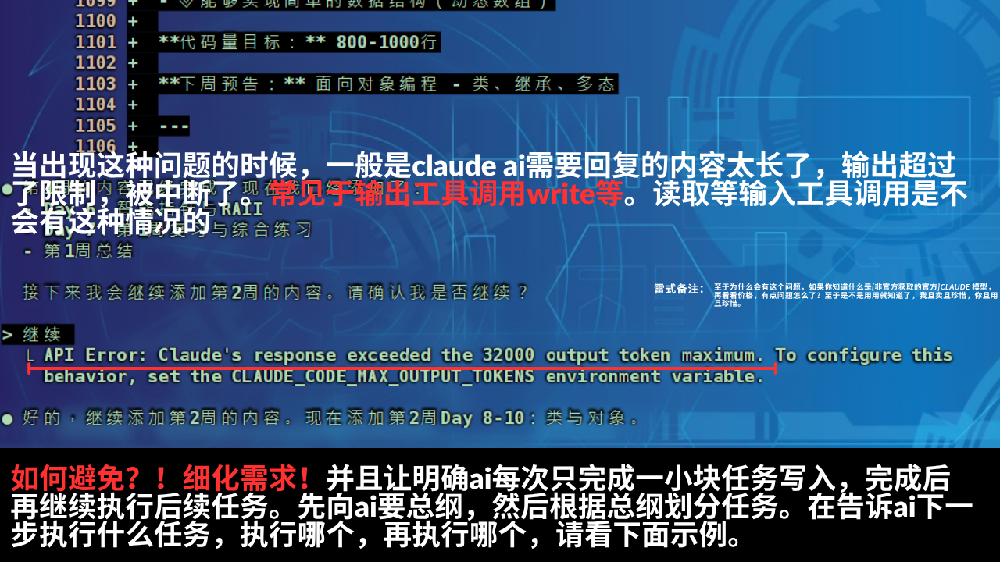
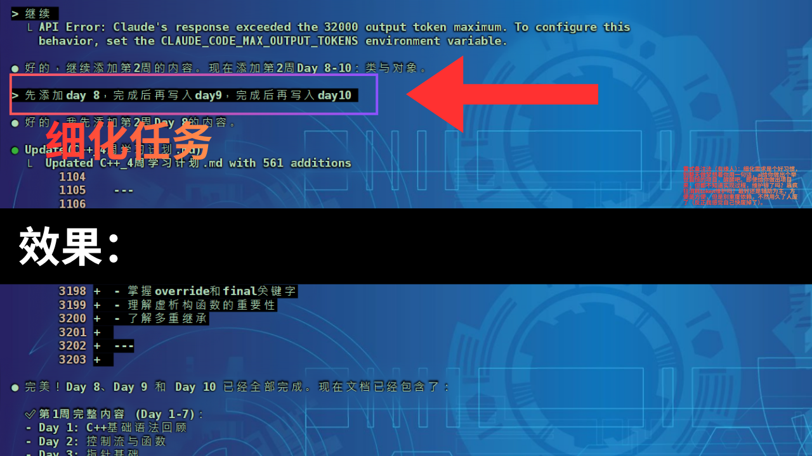

## 问题解析：Token 超出限制错误（当且仅当当前请求出现[response exceeded the 32000 output token maximum]的提示才需要细化，否则无需细化）

当您在使用 Claude AI 时，可能会遇到类似下图的错误信息：

```
API Error: Claude's response exceeded the 32000 output token maximum. To configure this behavior, set the CLAUDE_CODE_MAX_OUTPUT_TOKENS environment variable.
或 API Error: Cannot read properties of undefined (reading 'map')
```

这个错误意味着 AI 试图生成的回复内容太长，超出了单次响应的令牌（Token）数量上限。

### 核心原因

- **需要输出的内容过多**：一次性要求 AI 完成一个非常复杂或庞大的任务，也可能是简单任务，但是需要回复的内容非常长！导致其生成的代码、文档或解释过长。且等待时间会非常久，因为ai在服务端需要先生成所有内容，然后再传输过来，想象下你连续打一万以上的中英文混合字符，你要打多久，当然ai肯定比我们快多了，但是依旧需要时间。

简单来说，`要求输出内容` 的总长度超过了模型的处理极限时，就会中断并报错。

---

## 解决方案：细化任务（当且仅当当前请求出现[response exceeded the 32000 output token maximum]的提示才需要细化，否则无需细化）

解决这个问题的最有效方法是**细化任务**（Task Decomposition）。不要一次性提出一个大而全的要求，而是将其分解为一系列更小、更具体的步骤，引导 AI 逐一完成。

### 操作步骤（一般只有输出类工具调用才会有这种问题）

1.  **规划任务**：在开始前，先让 AI 给出总体目标，并根据目标规划出几个关键步骤。
2.  **分步执行**：让AI每次只操作实现一次细化后任务的写入或更改操作，完成一个步骤后再继续完成后续步骤。
3.  **确认并继续**：可以一次性说明执行步骤，如先实现xxx任务1（或任务1分三次生成，三次写入），完成后继续实现xxx任务2，等等。
4.  **优势**：任务越细化，任务越小，响应速度越块。

如下图所示，将一个长期的学习计划分解为每天的具体任务，可以有效避免单次输出内容过长的问题。



### 示例

假设您需要 AI 帮助您完成一个大型项目，可以直接将其分解为：

-   **第一步**：“请为我的项目创建目录结构。”
-   **第二步**：“好的，现在请为 `src/components` 目录创建 `Button.js` 和 `Card.js` 两个组件的基础模板。”
-   **第三步**：“接下来，请为 `Button.js` 组件编写样式。”

> 💡 **提示**：通过这种方式，您不仅可以避免 Token 限制问题，还能更好地控制项目的进程和代码质量，且速度流畅。
> 💡 **提示**：可以显示提示ai，将当前要完成的内容，如写入，”分N次生成，N次写入“

---

## 环境变量配置（说明）

> ⚠️ **注意**：设置环境变量 `CLAUDE_CODE_MAX_OUTPUT_TOKENS`，没什么用。过度依赖调高上限可能会导致响应延迟或内容质量下降。推荐首选“细化任务”的策略。
