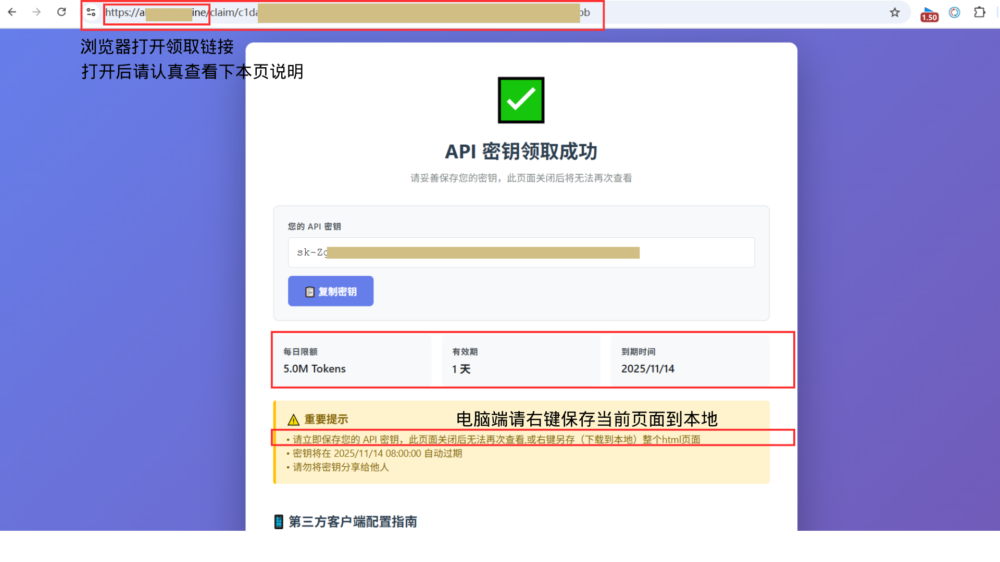
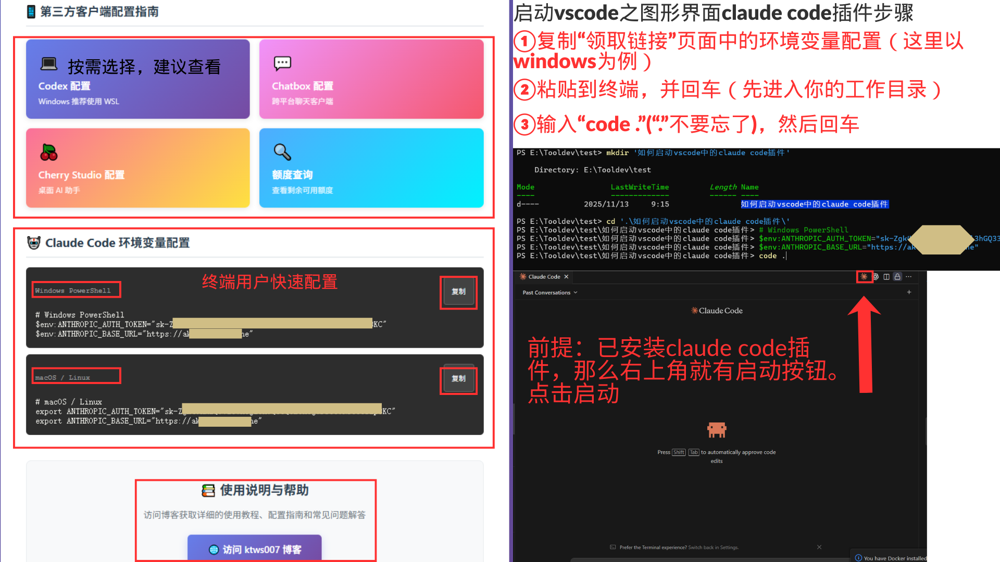

本教程将引导您完成获取 API 密钥，并通过正确的终端环境配置来启动 VSCode，以确保 Claude 插件成功连接。

---

## 第一步：获取并妥善保管您的 API 密钥

此步骤与之前相同，核心是获取并安全地保存您的 API 密钥。

在浏览器中打开链接，您将看到“API 密钥领取成功”的页面。



**API 密钥**是一串以 `sk-` 开头的字符。

**重要提示（请务必遵守）：**
- **立即保存密钥**： 点击【复制密钥】按钮，将密钥保存在您本地的安全位置。此页面关闭后无法再次查看密钥。
- **请勿分享**： 切勿将密钥泄露给他人。

---

## 第二步：在终端中配置环境变量并启动 VSCode

这是确保插件能读取到密钥的关键环节。请注意，这些操作需要在 VSCode 外部的系统终端中完成。

### 前提条件
- 您已经安装了 Visual Studio Code。
- 您已经在 VSCode 中安装了 "Claude Code" 插件。
- `code` 命令已经添加到了您系统的 PATH 环境变量中（通常在安装 VSCode 时会自动完成）。

### 1. 打开一个系统终端窗口
- **Windows 用户**： 打开 PowerShell 或命令提示符 (CMD)。
- **macOS / Linux 用户**： 打开“终端” (Terminal) 程序。

### 2. (可选) 进入您的项目目录
为了方便管理，建议先进入您打算使用 Claude 插件的工作目录。
```bash
# 示例：进入名为 "my-claude-project" 的文件夹
cd path/to/your/project
```

### 3. 在终端中设置环境变量
在同一个终端窗口中，根据您的操作系统，复制并执行相应的命令。请务必将命令中的 `sk-*********************` 和 `https://a****************b` 替换为您在第一步中获取的真实信息。（或直接复制领取链接中的环境变量配置）

**对于 Windows (PowerShell):**
```powershell
$env:ANTHROPIC_AUTH_TOKEN="sk-*********************"; $env:ANTHROPIC_BASE_URL="https://a****************b"
```

**对于 macOS / Linux (bash/zsh):**
```bash
export ANTHROPIC_AUTH_TOKEN="sk-*********************"; export ANTHROPIC_BASE_URL="https://a****************b"
```

### 4. 从当前终端启动 VSCode（关键步骤！）
在刚刚设置完环境变量的同一个终端窗口中，输入以下命令并按回车：
```bash
code .
```
**命令解释**： `code .` 会在当前目录 (`.`) 启动一个新的 VSCode 窗口。最重要的是，以这种方式启动的 VSCode 会继承您刚刚在终端中设置的环境变量。只有这样，Claude 插件才能成功读取到您的 API 密钥和链接。



---

## 第三步：启动并使用 Claude 插件

VSCode 启动后，您现在可以点击 VSCode 右上角的 Claude 插件图标来启动它。此时，插件应该能够成功连接并正常工作了。

### 总结关键点
插件的成功连接，依赖于 VSCode 在启动时就获得了正确的环境变量。因此，**必须先在终端设置变量，再从该终端使用 `code .` 命令启动 VSCode**，而不是通过桌面快捷方式启动。
